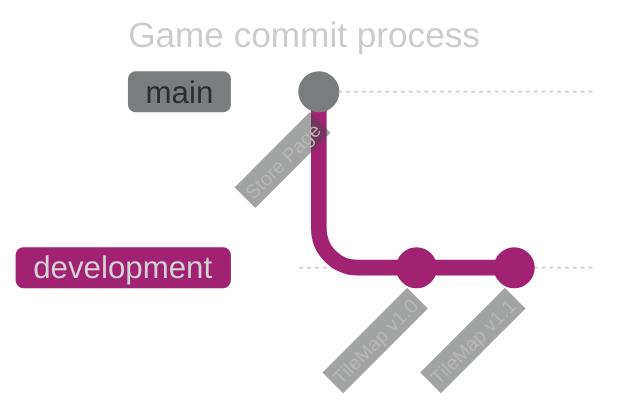
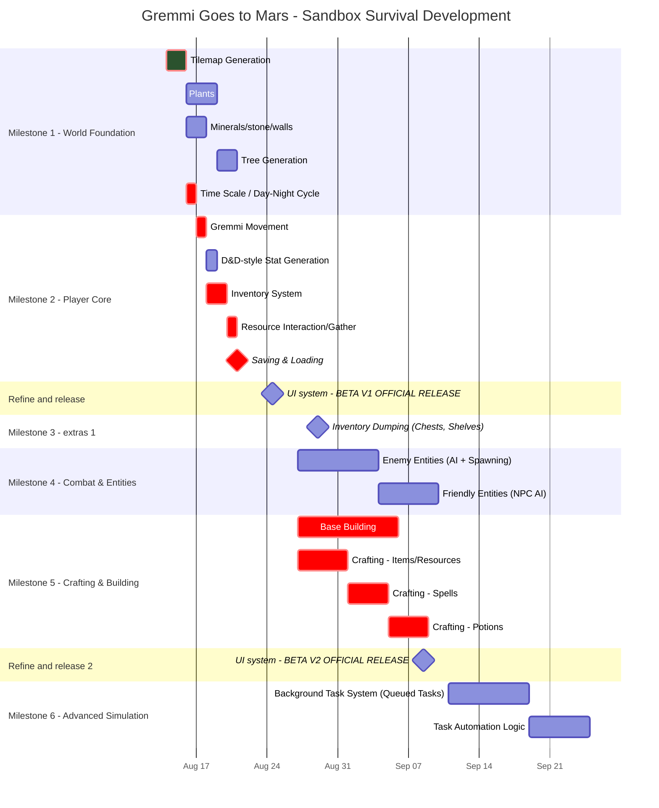

# Gremmi Goes To Mars

A goblin Banished to Mars by a petty kingdom
Gremmi, his name is, has only a few days to prepare for survival or ... be met with certain doom ... on Mars ...
His goals are
Befriend the witch, Unlock portals around Earth, Gather strange supplies, and Cast weird spells

All in this 2D survival fantasy where exile is just the beginning.

Craft. Farm. Fight. And maybe… get even.

## Game Development process:

main = Steam releases or updates

development = releases or changes to the game. These releases can be found for download in beta downloads (eg. [download](DownloadGame.md), Steam pre-release)

### Time line:

Green = complete

Red = critical path

